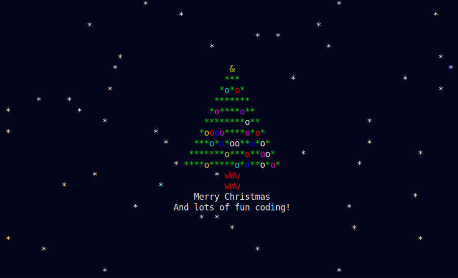

	
	<h1 align="center">ltree</h2>
	
Merry christmas 2021 :)

	
	
	
	   
	

Time flies fast, the year is coming to an end. Merry christmas to everyone! :)
Heavy inspiration from [ChristBASHTree](https://github.com/sergiolepore/christbashtree).

## Dependencies
- ncurses

## Make
Use `make all` to see all the make targets.

### Compiling
Run `make` or `make compile` which will create a binary in the `bin/` folder.

> If you want to change the compiler make uses, set the `C` variable. Example: `make C=gcc`
